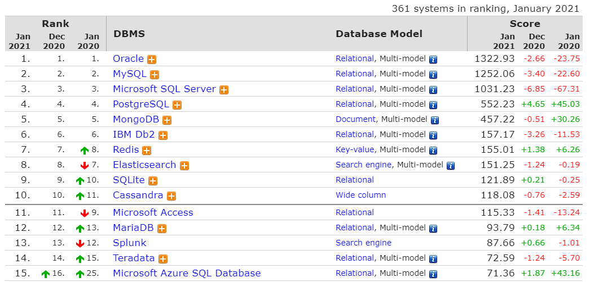
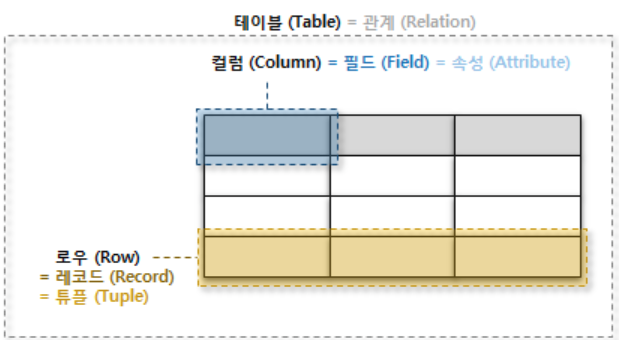

# RDBMS(Relational Database Management System)

## 1. DBMS 개요

### 1.1 데이터베이스의 정의와 특징

* Database란?
  * 체계화되 넫이터의 모임
  * 여러 응용 시스템들의 통합된 정보를 저장하여, 운영할 수 있는 공용 데이터의 묶음
  * 논리적으로 연관된 하나 이상의 자료 모음으로, 데이터를 고도로 구조화함으로써 검색/갱신 등의 데이터 관리를 효율화함.
* DBMS(Database Management System) 
  * 데이터베이스를 관리/운영하는 역할을 수행하는 시스템
  * Excel의 경우 대용량을 관리하지 않고, 여러 명의 사용자가 공유하지 않으므로 DBMS가 아님.
* Database의 장점
  * 1) 데이터 중복 최소화
  * 2) 데이터 공유
  * 3) 일관성, 무결성, 보안성 유지
  * 4) 최신의 데이터 유지
  * 5) 데이터의 표준화 가능
  * 6) 데이터의 논리적, 물리적 독립성
  * 7) 용이한 데이터 접근
  * 8) 데이터 저장 공간 절약
* Database의 단점
  * 1) 데이터베이스 전문가 필요
  * 2) 비용 부담
  * 3) 시스템의 복잡함

* DB-Engines Ranking Top 15 (Jan. 2021)

​	출처 : https://db-engines.com/en/ranking

### 1.2 RDBMS(Reational Database Management System, 관계형 데이터베이스 관리 시스템)

* 데이터베이스의 한 종류로, 가장 많이 사용됨.
* 역사가 오래되어, 가장 신뢰성이 높고, 데이터 분류 / 정렬 / 탐색 속도가 빠름
* 2차원 테이블(Table) 형식을 이용해 데이터를 정의하고 설명하는 데이터 모델
* RDBMS에서는 데이터를 속성(Attribute)과 속성값(Attribute Value)으로 구조화 된 2차원 Table 형태로 만들어진다.
  * 데이터를 구조화한다는 것은 속성과 속성값 사이에서 관계(Relation)를 찾아내고, 이를 테이블 모양의 구조로 도식화하는 것을 의미한다.

* **주요 용어**
  * Primary Key(기본키)
    * Primary Key(PK)는 한 테이블(Table)의 각 로우(Row)를 유일하게 식별해주는 컬럼(Column)으로, **<u>각 테이블 마다 PK가 존재해야 하며</u>**, **<u>NULL 값을 허용하지 않고**</u>, 각 Row 마다 **<u>유일한 값(unique)</u>**이어야한다.
  * Foreign Key(외래키)
    * Foreign Key는 한 테이블의 필드 중 다른 테이블의 행(Row)을 식별할 수 있는 키

### 1.3 Database Schema

* 데이터베이스의 테이블 구조 및 형식, 관께 등의 정보를 형식 언어로 기술한 것
  * 1) RDBMS를 사용해 데이터를 저장할 때, 가장 먼저 해야 할 일은 데이터의 공통 속성을 식별하여 컬럼으로 정의하고, 테이블을 만드는 것이다.
  * 2) 일반적으로 하나의 테이블이 아닌 여러 개의 테이블로 만들고, 각 테이블 구조 / 형식 / 관계를 정의한다.
  * 3) 이를 스키마라고 하며, 일종의 데이터베이스 설계도로 이해 가능.
  * 4) DB마다 스키마를 만드는 언어가 존재하며, 해당 스키마만 있으면 동일한 구조의 DB를 만들 수 있다.(DB 백업과는 달리 데이터 구조만 동일하게 만들 수 있다.)

### 1.4 SQL(Structured Query Language)

* RDBMS에서 데이터를 관리하기 위해 사용되는 표준 프로그래밍 언어
* 데이터베이스 스키마 생성 및 수정, 데이터 추가, 수정, 삭제, 조회 등 DB와 관련된 거의 모든 작업을 위해 사용됨
* SQL의 특징
  * 1) DBMS 제작 회사와 독립적이다.
  * 2) 다른 시스템으로 이식성이 좋다.
  * 3) 표준이 계속 발전하고 있다.
  * 4) 대화식 언어이다.
  * 5) 분산형 클라이언트/서버 구조

#### - SQL의 종류

##### 1) Data Definition Language(DDL, 데이터 정의어)

* Table, Index 등의 개체를 만들고 관리하는데 사용되는 명령
* `CREATE`, `ALTER`, `DROP` 등이 있음

##### 2) Data Manipulation Language(DML, 데이터 조작어)

* 데이터 생성(Create), 조회(Read), 갱신(Update), 삭제(Delete)와 관련된 언어
* `INSERT`, `UPDATE`, `DELETE`, `SELECT`

##### 3) Data Control Language(DCL, 데이터 제어어)

* 데이터 권한 설정, 데이터 무결성 처리 등을 수행
* `GRANT`, `REVOKE`

##### 4) Transaction Control Language(TCL, 트랜잭션 제어어)

* 데이터베이스의 논리적 연산단위인 트랜잭션을 제어하기 위한 명령어

* `SAVEPOINT`, `COMMIT`, `ROLLBACK`

