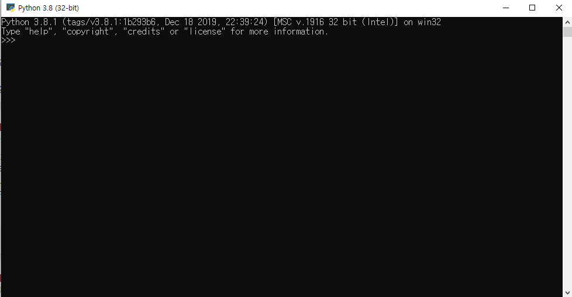
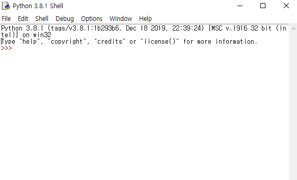

# Python

## 1. 파이썬이란?

* 범용 프로그래밍 언어
* 인터프리터 언어(<-> 컴파일 언어(C, JAVA); )
  * 한 줄의 문장을 입력하고, 엔터키를 치면 인터프리터키가 해석해서 바로 실행함.
  * 컴파일 언어에 비해 실행 속도가 느리다는 특징.(인터프리터 언어는 명령할 때마다 해석하기 때문에 느림.)
* 1991년 귀도 반 로섬이 C 언어로 제작해서 발표하였다.

* 파이썬의 특징

  * 읽고 사용하기 쉬움.
    * 쉬운 문법으로 간결하면서 효율적인 프로그램을 빠르게 작성 가능함.
  * 무료 사용 가능
    * 오픈소스, 다양한 추가 라이브러리도 무료로 사용이 가능
  * 다양하고 강력한 외부 라이브러리(프로그램의 집합을 미리 만들어 놓은 것)들이 풍부함.
    * 외부에서 제공하는 다양한 서드 파티(Third Party) 라이브러리까지 사용 가능
  * 유연하고 개발 속도가 빠름.
    * 다른 언어로 개발된 API를 사용할 수 있는 인터페이스를 내장하고 있어 기능을 무한히 확장 가능.
    * 성능은 조금 느리지만, 생산성이 높아 C 언어에 비해 개발 기간이 짧다.
  * 플랫폼에 독립적이다.
    * 다양한 운영체제에서 모두 사용 가능.(운영체제에 맞는 인터프리터만 설치하면 됨.)
    * 따라서 이기종 간의 통신 환경인 웹에 유리함.
  * 강력한 웹 프레임워크를 사용할 수 있다.
  * 객체지향적이며 클래스를 지원한다. 간단하게 쓸 수도 있고, 전문 개발 언어 못지 않은 복잡한 작업도 처리할 수 있다.

* 파이썬의 단점

  * 속도가 느리다.

    * 컴파일 언어가 아닌 스크립트 언어이기 때문에, 컴파일러 언어보다 느리다.

      -> 이를 보완하기 위해 파이썬 패키지를 최적화 시키고 있다.

  * 모바일 컴퓨팅 분야 지원이 약하고, 하드웨어 제어 등과 관련된 부분 사용이 어려움.

* 파이썬의 활용 분야

  * 유틸리티 제작
  * 웹 프로그래밍
  * 임베디드
  * 데이터베이스
  * 교육용

  

## 2. 개발 환경 구축

* 1) 파이썬 설치

  * [파이썬 홈페이지](https://www.python.org)
  * 설치중 Add Python version to PATH 체크
    * 컴퓨터 어느 폴더에서나 파이썬이 실행되게 하는 옵션

  

> 설치 후 Python을 실행하면 Console 창이 뜸.

>  자체 제공 편집기인 IDLE를 통해서 간단한 프로그래밍을 할 수 있다. 하지만 불편.
>
> -> 파이참을 활용

* 2) PyCharm(파이참) 설치
  * [파이참 다운로드](https://www.jetbrains.com/pycharm/download/?gclid=Cj0KCQiA_qD_BRDiARIsANjZ2LDlw9Uf7YzMEir9t6LZOTw2vtFEne2WYVXX8xItFljHIVrO_DG_noAaAvSBEALw_wcB#section=windows)
  * 파이썬 확장자 (.py)

