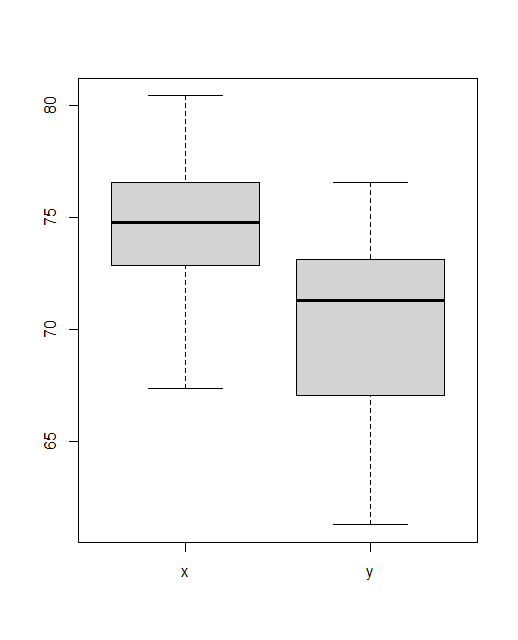

# t검정

## 1. 기본 개념

### 1) 개요

* 비교대상과 원대상 간의 차이를 확인하고, 그것이 통계적인 의미(수준)에서 차이가 있는지를 살펴보기 위해 **비교**를 함
* 통계에서 가장 기본적인 비교는 평균비교이며, 그중에서도 가장 기본이 되는 분석방법이 **t검정**이다.
* 보통 비교하고자 하는 집단이 2개일 때는 t검정 수행, 3개 이상일 때는 분산분석(anova)을 함.


### 2) 통계적 접근

* 비교집단을 어떻게 볼 것인가에 따라서 t검정은 일표본 t검정, 독립표본 t검정, 대응표본 t검정으로 구분함.

  * **일표본 t검정(one sample t-test) **

    모집단의 정보를 알고 있을 때 수집한 표본의 평균과 일치하는지 여부를 확인하는 검정

  * **독립표본 t검정(independent t-test)**

    독립적인 두 집단의 평균 차이를 비교하기 위한 검정 (Ex. 상위집단/하위집단, 남자/여자)

  * **대응표본 t검정(paired t-test)**

    동일한 대상자를 대상으로 사전/사후 같은 2개의 결과를 비교하기 위한 검정(Ex. 사전/사후)

* t검정은 30개 이하의 소표본과 그 이상의 표본에서 사용할 수 있는 평균비교 방법이다.

* 단, 데이터의 개수가 적거나 평균이 치우친 경우처럼 비모수(non-parametric)적인 접근을 해야할 때가 있다.(보통 표본의 개수가 10개 이하인 경우)

  * 이때 비모수 분석은 평균을 비교하는 것이 아니고 **순위(rank)를 비교하는 방식**이기 때문에 해석 시 평균 차이에 대한 통계적 유의성에 대한 해석은 삼가야 함.


### 3) 가설 설정

* t검정에 대한 일반적인 가설(양측)
  * H0 : 각 집단 간 평균 차이가 없다.
  * H1 : 각 집단 간 평균 차이가 있다.
  * p값 > 유의수준(alpha) -> H0 채택(accept) -> 평균 차이가 없다.
  * p값 < 유의수준(alhap) -> H0 기각(accept) -> 평균 차이가 있다.


## 2. 분석하기

### 1) R을 이용한 가설검정

* 한 모집단에서 모평균에 대한 가설검정

  ```R
  t.test(x, y = NULL,
         alternative = c("two.sided", "less", "greater"),
         mu = 0, paired = FALSE, var.equal = FALSE,
         conf.level = 0.95, ...)
  ```

* 한 모집단에서 모비율에 대한 가설검정

  ```R
  prop.test(x, n, p = NULL,
            alternative = c("two.sided", "less", "greater"),
            conf.level = 0.95, correct = TRUE)
  ```

  

### 2) 독립표본 t검정

* 독립표본
  * 서로 다른 특성을 갖는 표본을 말함. 
  * Ex. (남자 / 여자 ), (비행기 타본 사람 / 비행기 한 번도 안타본 사람)
* 서로 다른 특성을 갖는 두 표본의 평균을 비교하는 분석방법 -> 독립표본 t검정


#### 2-1) 분산의 동질성(등분산) 검정(homogenity of variance)

* 등분산(equal variance)
  * 개별 집단(그룹)의 관측값에 대하여 분산의 형태가 같다는(동일한 무리의 분산) 의미를 가짐.

-> 서로 다른 2개의 집단에 대한 비교이기 때문에, 분산(또는 표준편차와 같은 데이터의 퍼짐 정도)은 동일한 정도이길 원함.

* 똑같은 변동폭(분산 or 표준편차)을 가지고 있으면 순수한 평균 차이를 확인할 수 있음.

* 등분산 검정 방법

  * F검정, Bartlett 검정 : 정규성을 전제로 하는 데이터에 대해서만 정확한 검정이 가능
  * Levene 검정 : 정규성이 아닌 경우에도 사용할 수 있는 방법

  

#### - 추론 단계

1. 데이터 분포확인 -> 시각화, 기술통계 -> 이상치, 결측치
2. 정규성 검정 수행(소표본 : n1 < 30, n2 < 30)
3. `var.test()`를 사용해 두 모집단의 분산이 같은지 검정 수행
4. `t.test()`로 모집단의 평균을 비교


#### - 실습

* 화학 공정에서 첨가제의 종류에 따라 수율에 차이가 있는지 검정

```R
> x <- c(68.86, 74.64, 75.80, 76.41, 67.37, 79.98, 74.95, 76.36,
+        72.39, 76.73, 75.56, 73.59, 78.49, 69.49, 72.38, 73.38, 
+        77.29, 80.43, 73.94, 73.35)
> y <- c(65.92, 64.49, 68.24, 74.38, 70.82, 61.30, 73.09, 71.20,
+        74.31, 73.14, 68.76, 71.12, 65.62, 72.11, 72.20, 76.57, 
+        65.26, 73.82, 71.42, 71.93)

## 1. 시각화
> boxplot(x, y, names=c('x', 'y'))
```



* x가 y에 비해 평균이 높다. 이상치는 두 데이터 모두 없다.

```R
# 2. 정규성 검정 수행(소표본이므로)
> shapiro.test(x) # p > 0.05 -> 귀무가설이 정규분포를 한다.

	Shapiro-Wilk normality test

data:  x
W = 0.97078, p-value = 0.7712

> shapiro.test(y) # p > 0.05 -> 귀무가설 채택

	Shapiro-Wilk normality test

data:  y
W = 0.93598, p-value = 0.2011

```

* 검정 수행 결과 유의수준 0.05에서 p값 > 0.05이므로 두 집단 모두 정규성을 만족

```R
# 3. 등분산성 검정
> var.test(x, y) # p > 0.05 -> 등분산성을 만족함

	F test to compare two variances

data:  x and y
F = 0.74607, num df = 19, denom df = 19, p-value = 0.5293
alternative hypothesis: true ratio of variances is not equal to 1
95 percent confidence interval:
 0.2953021 1.8849001
sample estimates:
ratio of variances 
         0.7460664 
```

* 검정 수행 결과 유의수준 0.05에서 p값 > 0.05이므로 두 집단은 등분산성을 만족

```R
# 4. 모집단의 평균을 비교
# 두 집단의 분산이 같으므로 var.equal 옵션을 TRUE로 줌
> t.test(x, y, alternative = 'two.sided', var.equal = TRUE)

	Two Sample t-test

data:  x and y
t = 3.6451, df = 38, p-value = 0.0007967
alternative hypothesis: true difference in means is not equal to 0
95 percent confidence interval:
 1.904979 6.664021
sample estimates:
mean of x mean of y 
  74.5695   70.2850 

```

* 검정 수행 결과 alpha : 0.05에서 p값 < 0.05이므로 귀무가설을 기각한다.

  -> 두 표본의 평균이 차이가 있다.