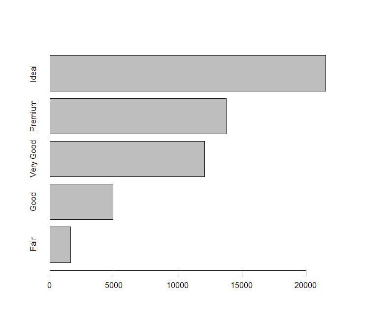
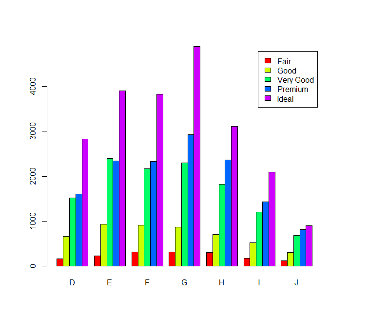
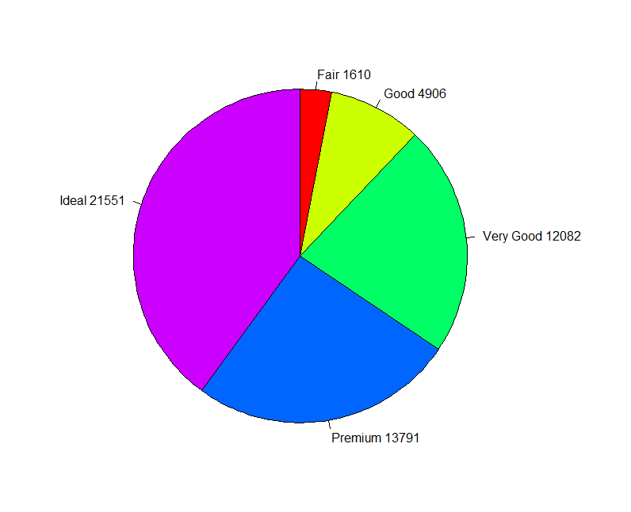
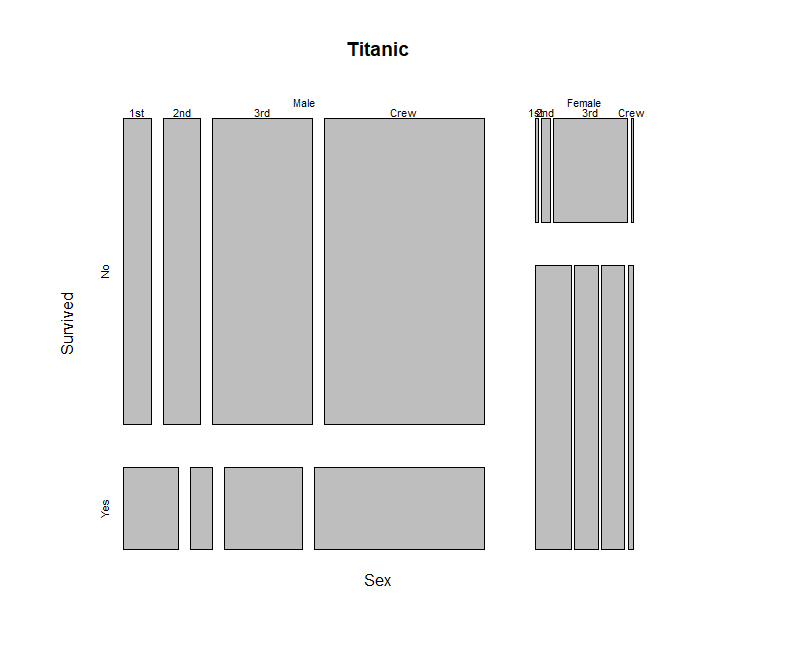
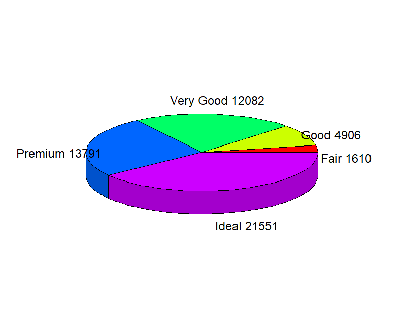
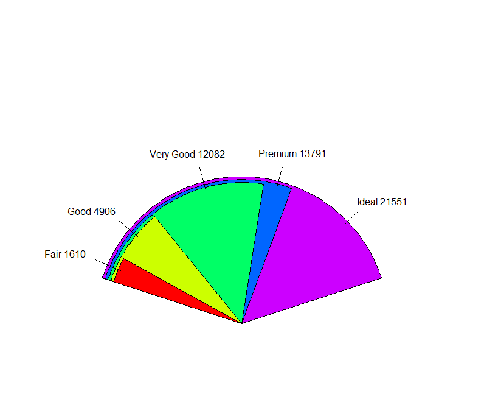

# 범주형 데이터 분석

* 범주형 데이터

  관측 대상이 이미 정해져 있는 여러 범주 중 어느 하나에 속하는지를 관측한 값.

  문자로 표시되거나 숫자로 표시되더라도, 숫자의 속성을 가지지 않고 범주를 나타냄


* 범주형 데이터 분석 방법
  * 도표와 그래프로 요약
    * 막대그래프, 원그래프, 모자익 플롯
  * 적합도 검정
    * 관측도수가 이론적 기대도수와 잘 일치하는지 검정
  * 카이제곱 검정
    * 범주형 범수들 간의 관계를 검정


## - 도수분포표와 분할표

* 빈도표

  ```R
  table(...,
        exclude = if (useNA == "no") c(NA, NaN),
        useNA = c("no", "ifany", "always"),
        dnn = list.names(...), deparse.level = 1)
  ```

  * 사용 예시

    `ggplot2`의 diamonds data

  ```R
  # 다이아몬드 색의 빈도표 
  table(diamonds$color)
  
      D     E     F     G     H     I     J 
   6775  9797  9542 11292  8304  5422  2808 
  
  # 다이아몬드 컷팅 등급 빈도표를 cut.Freq에 저장
  > cut.Freq <- table(diamonds$cut)
  > cut.Freq
  
       Fair      Good Very Good   Premium     Ideal 
       1610      4906     12082     13791     21551 
  
  # addmargins를 통해 총계를 추가할 수 있음
  > addmargins(cut.Freq)
  
       Fair      Good Very Good   Premium     Ideal       Sum 
       1610      4906     12082     13791     21551     53940 
  ```

  * `xtabs()`
    * `xtabs()`를 통해서는 formula 사용해서 빈도표를 구할 수 있다.

  ```R
  > df <- data.frame(x=c('A', 'B', 'A', 'B'), y=c('1', '2', '2', '1'),
  +                 num=c(3, 5, 7, 10))
  > df
    x y num
  1 A 1   3
  2 B 2   5
  3 A 2   7
  4 B 1  10
  
  # x, y라는 두 변수가 있고, 이 두 데이터에 대한 도수가 num에 저장되어 있을 때,
  # formula는 num ~ x+y 형태로 들어감
  > xtabs(num ~ x + y, data=df)
     y
  x    1  2
    A  3  7
    B 10  5
  
  # 만약 도수를 나타내는 컬럼이 없다면 ~변수 + 변수 +... 형태로 작성
  > xtabs(~ x + y, data=df)
     y
  x   1 2
    A 1 1
    B 1 1
  ```

  

* `prop.table()`

  * 분할표로부터 각 셀의 비율을 계산함
  * 1은 행(row)% , 2는 열(column) %을 출력하라는 의미임
  * 숫자 옵션을 사용하지 않는 경우, 전체(total)에 대한 %를 산출

  ```R
  # mtcars 데이터셋
  
  # 범주형 변수는 factor 형으로 바꾸는 것이 좋음
  mtcars$cyl.f <- factor(mtcars$cyl, levels = c(4, 6, 8), labels=c('4', '6', '8'))
  
  mtcars$gear.f <- factor(mtcars$gear, levels = c(3, 4, 5), labels=c('3', '4', '5'))
  
  mtcars$am.f <- factor(mtcars$am, levels = c(0, 1), labels = c('auto', 'standard'))
  
  # 팩터형으로 바꾼 mtcars 데이터에
  # 실린더와 트랜스미션의 빈도표 계산
  > ft <- xtabs(~cyl.f + am.f, data=mtcars)
  > ft
       am.f
  cyl.f auto standard
      4    3        8
      6    4        3
      8   12        2
  
  # 숫자 옵션 미사용시 전체에 대한 % 산출
  > prop.table(ft)
       am.f
  cyl.f    auto standard
      4 0.09375  0.25000
      6 0.12500  0.09375
      8 0.37500  0.06250
  
  # 행
  > prop.table(ft, 1)
       am.f
  cyl.f      auto  standard
      4 0.2727273 0.7272727
      6 0.5714286 0.4285714
      8 0.8571429 0.1428571
  
  # 열
  > prop.table(ft, 2)
       am.f
  cyl.f      auto  standard
      4 0.1578947 0.6153846
      6 0.2105263 0.2307692
      8 0.6315789 0.1538462
  ```

  

### - 범주형 데이터의 시각화

#### 1) 막대그래프

```R
# par()는 그래프를 표시할 창에 대해 설정
## mfrow : 그래프 출력할 창을 어떻게 분할할지 지정 (row, col) : (1,1) -> 분할 X
## mar : margin 지정
> par(mfrow=c(1, 1), mar=c(5, 5, 5, 7)) 
> barplot(table(diamonds$cut), horiz = T)
> barplot(table(diamonds$cut, diamonds$color), col = rainbow(5), 
+         legend=T, beside = T) # beside 옵션을 통해 스택형을 제거할 수 있음
```

<div style='width:100%;'>
 
  
</div>


#### 2) 파이그래프

```R
> # 범례 옆에 값을 달아줄 수도 있음
> feq <- table(diamonds$cut) # 빈도 수 테이블 저장
> lbl <- paste(names(feq), feq) # 변수명과 빈도수 붙임 paste() : 두 값을 합침
> # 3시 방향에서 시작해 반시계방향으로 돌아감(clockwise)
> pie(table(diamonds$cut), clockwise = TRUE, radius = 1, col=rainbow(5),
+     labels = lbl) 
```

<center></center>

#### 3) 모자익 플롯

* 2원 3원 교차표를 시각화한 그래프

```R
> # mosaicplot() 교차하는 지점의 빈도표 시각화를 모자이크 형태로 가능
> mosaicplot(~Sex + Survived + Class, data=Titanic)
```



#### 4) 기타 

* plotrix package를 사용해 3D로도 출력 가능

  ```R
  install.packages('plotrix')
  > library(plotrix)
  > pie3D(feq, labels=lbl)
  ```

  

* `fan.plot()`으로 부채꼴 형식으로도 출력 가능(비슷한 경우 비교 가능)

```R
> ?fan.plot
> fan.plot(feq, labels = lbl)
```




## - 적합도 검정

* 관측값(표본)이 특정한 확률분포를 따르는지 검정
  * 하나의 범주형 변수의 경우, 각 범주에 속하는 분포에 관심을 가진다
  * k개의 범주(혹은 계급)을 가지는 한 개의 요인(factor)에 대해서 어떤 이론적 분포를 따르고 있는지를 검정하는 방법
  * 가설
    * 귀무가설 : 관측값의 도수와 가정한 이론 도수가 동일하다.
    * 대립가설 : 적어도 하나의 범주의 도수가 가정한 이론 도수와 다르다

* R의 함수

  ```R
  chisq.test(x, y = NULL, correct = TRUE,
             p = rep(1/length(x), length(x)), rescale.p = FALSE,
             simulate.p.value = FALSE, B = 2000)
  ```

  * x : 숫자벡터 또는 행렬, 또는 x와 y 모두 벡터

```R
> # 주사위를 100번 던지는 경우의 예
> x1 <- c(22, 19, 26, 25, 17, 11)
> p1 <- rep(1/6, 6)
> chisq.test(x1, p=p1)

	Chi-squared test for given probabilities

data:  x1
X-squared = 7.8, df = 5, p-value = 0.1676
```

* p-value가 0.1676이므로 유의수준 alpha 0.05보다 크므로 귀무가설을 채택한다.
* 따라서 균등분포를 따르고 있다고 볼 수 있다.


## - 독립성 검정

* 두 개의 범주형 변수 간의 관계가 서로 독립인지 아닌지를 분석
* 서로 다른 요인들에 의해 분할되어 있는 경우 그 요인들이 관찰값에 영향을 주고 있는지 아닌지, 요인들이 서로 연관이 있는지 없는지를 검정함.
* 독립성 검정 결과는 두 변수가 서로 독립인지 아닌지를 판단하며, 만약 독립성이 아니라면, 두 변수 간에 관련성이 있다고 해석함.

* 가설
  * 귀무가설 : 두 변수 X와 Y는 서로 독립이다(관련성이 없다)
  * 대립가설 : 두 변수 X와 Y는 서로 독립이 아니다.(관련성이 있다)


* R의 함수

  * `chisq.test()`로 독립성 검정 수행 가능

  ```R
  > # 예) 100명의 고객 신용평가 자료에서 Income과 Credit 관련성 검정
  > data <- read.csv('data/credit.csv', header = T, stringsAsFactors = T)
  > str(data)
  'data.frame':	100 obs. of  3 variables:
   $ Age   : int  40 40 40 20 30 40 40 30 40 40 ...
   $ Income: Factor w/ 3 levels "high","low","medium": 3 3 1 3 1 2 3 3 2 3 ...
   $ Credit: Factor w/ 3 levels "bad","excellent",..: 2 3 3 1 3 1 2 3 1 1 ...
  
  # 독립성 검정
  ## formula 형태로 넣어줘도 됨
  > chi_test_inde <- chisq.test(data$Income, data$Credit)
  > chi_test_inde
  
  	Pearson's Chi-squared test
  
  data:  data$Income and data$Credit
  X-squared = 0.37808, df = 4, p-value = 0.9842
  
  
  # 빈도표 형태로 만들어 넣어줘도 됨
  > cross.Income_Credit <- xtabs(~Income+Credit, data=data)
  > cross.Income_Credit
          Credit
  Income   bad excellent fair
    high    12        11   16
    low      7         5    9
    medium  13         9   18
  > chi_test_inde2 <- chisq.test(cross.Income_Credit)
  > chi_test_inde2
  
  	Pearson's Chi-squared test
  
  data:  cross.Income_Credit
  X-squared = 0.37808, df = 4, p-value = 0.9842
  ```

  * p-value 0.9842로 유의수준 alpha 0.05보다 커 Income과 Credit 간에 서로 관련성이 없다. 즉, 독립적이다라고 판단할 수 있다.


## - 동질성 검정

* 분할표 상의 두 변수에 대해 모집단 비율(분포)이 같은지를 검정하는 방법
* 동질성 검정과 독립성 검정은 단지 가설에서 차이가 나며 검정방법은 같음
* 관측값들이 정해진 범주 내에서 서로 비슷하게 나타나고 있는지를 검정
* 속성 A, B를 가진 부모집단(subpopulation) 각가으로부터 정해진 표본의 크기만큼 자료를 추출하는 경우에 분할표에서 부모집단의 비율이 동일한가를 검정. 두 개의 요인을 대상으로 함.


### - Fisher의 정확성 검정(Fisher's Exact Test)

* 2X2 교차표에서 기대빈도가 5보다 작은 셀이 20% 이상인 경우, 카이제곱 검정 대신 **피셔의 정확검정** 수행이 좋음
* mariginal 빈도가 주어진 상황에서 **셀의 빈도 + 확률을, 모든 가능한 경우의 수에 대해 계산**해 두 변수가 관련성이 없다는 귀무가설 하에서 셀에 들어갈 값이 실제 관측된 값이 실제 관측된 값보다 작거나 혹은 같은 경우가 나올 확률을 구함.

* 모든 경우의 수를 계산해야 하다 보니 범주가 많은 경우 시간이 오래걸림.

* 사용 예시 
  * vcd::Arthritis 데이터셋
  * H0 : 치료와 개선여부 변수는 독립적이다.

```R
> library(vcd)
> # 빈도표 작성(처치에 따른 개선효과 이원분할표)
> mytable <- xtabs(~Treatment+Improved, data=Arthritis)
> mytable
         Improved
Treatment None Some Marked
  Placebo   29    7      7
  Treated   13    7     21

> # 카이제곱 검정 수행
> ch <- chisq.test(mytable, correct=F)
> ch 

	Pearson's Chi-squared test

data:  mytable
X-squared = 13.055, df = 2, p-value = 0.001463

> # 기대값 산출
> ch$expected
         Improved
Treatment None     Some   Marked
  Placebo 21.5 7.166667 14.33333
  Treated 20.5 6.833333 13.66667

> # 피셔의 정확 검정 수행
> fisher.test(mytable)

	Fisher's Exact Test for Count Data

data:  mytable
p-value = 0.001393
alternative hypothesis: two.sided
```

