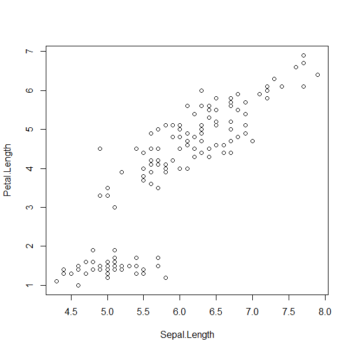
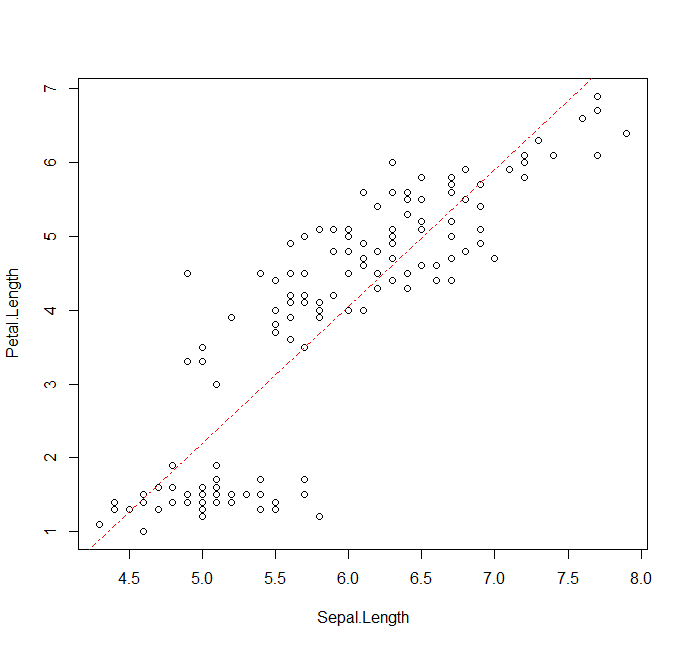
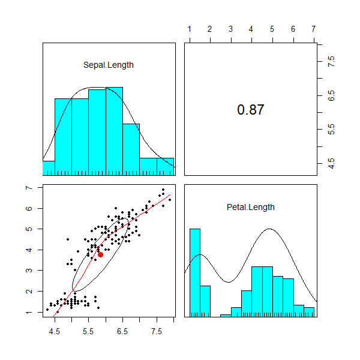

# 상관분석

* 상관분석을 하는 이유?
  * 상관분석은 관계성 개념에 주목하는 가장 기본적인 분석으로 이를 통해 1차적인 관계성을 확장하여 고차원적인 관계성을 만들어줄 수 있음.
  * 관계성이 있는 데이터를 취합했는지 확인하기 위해서 상관분석을 하고, 관계성이 가장 높은 변수를 주요 변수로 생각하며, 분석 결과에 따라서 추가적인 데이터를 확보하려 노력하는 일련의 과정이 모두 상관분석과 연관이 있다.


##  - 산점도의 작성과 유형

* 산점도(scatter plot)
  * 두 변수 X, Y의 관측치 (xi, yi)를 좌표평면상에 점으로 나타낸 그림
  * 두 개의 변수를 x와 y의 그래프로 나타내어, 이들의 분포 정도를 확인
  * 표본이 가지는 중심경향을 파악한 후, 표본이 분포하고 있는 정도를 나타냄

* R 함수

  * `plot(x, y, ...)`

* 예시 

  * iris dataset의 Sepal Length와 Petal Length의 산점도

  ```R
  # dplyr 패키지 부착
  > library(dplyr)
  # iris dataset에서 Sepal.Length와 Peral.Length 컬럼 선택
  > irisData <- iris %>% select(Sepal.Length, Petal.Length)
  # 산점도 그리기
  plot(Petal.Length ~ Sepal.Length, data=irisData)
  ```

  

* 산점도를 그리는 것이 중요한 것이 아니라, 이를 통해 자료의 특성을 개략적으로 이해하는 것이 중요함.
* 아래와 같이 **양의 상관**의 유형 또는 **음의 상관**의 유형을 이해해야 함

 


## - 공분산(Covariance)

* 두 변수 간의 공통 분산
* 2개의 확률변수의 선형 관계를 나타내는 값

[](https://datacookbook.kr/38)

<small style="text-align: left; padding-left: 15%;"><a href='https://datacookbook.kr/38'>공분산</a></small>

* 두 변수의 단위에 의존하여 다른 데이터와 비교 시 불편하다.

  * 척도 단위에 따라 민감하게 반응함 -> 표준화 필요(상관계수)

  

## - 상관계수(Correlation Coefficient)

* 두 변수(방향, 강도)의 관계를 하나의 수치로 나타낸 척도
  1. 방향 - 음 또는 양
  2. 강도 - 얼마나


##### - 상관계수의 검정

* 가설

  * 귀무가설 : 두 변수 간의 상관관계는 없다.
  * 대립가설 : 두 변수 간의 상관관계는 있다.

  

## - 상관분석

* 두 연속형 변수 사이의 선형관계를 분석
* 두 변수 간 상호의존관계가 있을 때 이 관련성을 통계적으로 분석
* 관련된 두 변수가 있을 때 하나의 변수에 대한 정보를 가지고 다른 변수를 예측하거나 설명할 때
* 두 변 수 사이에 강한 관련성이 있을 경우에는 한 변수에 대한 정보를 가지고 다른 변수를 예측할 수 있음.


* 상관 분석의 가정

  * 두 변수 X와 Y는 이변량 정규분포를 따른다.

* X와 Y의 상관계수

  * X와 Y가 독립이라면 상관계수는 0이다.

  * X, Y가 이변량 정규분포를 하는 경우 상관계수가 0이면, X, Y는 독립이다.

    

## - R을 이용한 상관분석 단계

1. 쌍으로 관측된 두 자료를 x-y좌표 상에 점으로 나타낸 **산점도**를 통해 두변수의 선형관계를 대략적으로 파악한다.

* 관련 R 함수
  * `pysch::pairs.panels()`
  * 위의 irisData 그대로 이용

  ```R
  > pairs.panels(irisData)
  ```

  

  * 오른쪽 아래로 향하는 대각선 방향으로는 각 x, y 변수의 히스토그램과 밀도곡선(`density=T`)을 그려줌.
  * 2번째 plot의 숫자는 상관계수를 나타내줌.
  * 3번째 plot은 x와 y 변수의 scatter plot과 loess(local regression)(`smooth=T`) 선을 그려줌. (`lm=T`로 회귀 곡선으로 보이게 할 수 있음.)

  * 여러 변수가 있어도 각각을 쌍으로 비교 가능

  

  * `plot()`, `abline()`
    * 위의 산점도 그래프 참고


2. 선형의 강도를 나타내는 척도인 **상관계수**를 이용해 두 변수 사이의 선형관계를 분석

* 관련 R 함수

  * `cor()`
  * `cor.test()`

  ```R
  > ## 상관계수와 가설검정
  > cor(irisData)
               Sepal.Length Petal.Length
  Sepal.Length    1.0000000    0.8717538
  Petal.Length    0.8717538    1.0000000
  
  > cor(irisData, use = "complete.obs", method="pearson")
               Sepal.Length Petal.Length
  Sepal.Length    1.0000000    0.8717538
  Petal.Length    0.8717538    1.0000000
  
  > cor.test(irisData$Sepal.Length, irisData$Petal.Length)
  
  	Pearson's product-moment correlation
  
  data:  irisData$Sepal.Length and irisData$Petal.Length
  t = 21.646, df = 148, p-value < 2.2e-16
  alternative hypothesis: true correlation is not equal to 0
  95 percent confidence interval:
   0.8270363 0.9055080
  sample estimates:
        cor 
  0.8717538 
  ```

  * 위의 irisData(Sepal.Length, Petal.Length)를 통해 상관 분석한 결과,

    p-value = 2.2e-16  < 유의수준 alpha 0.05이므로 귀무가설을 기각함.

    즉, 두 표본 간의 상관관계가 있다고 볼 수 있음.


###  - 여러 변수의 상관관계 유의성 검정

```R
> irisCor <- cor(iris[, 1:4])
> irisCor
             Sepal.Length Sepal.Width Petal.Length Petal.Width
Sepal.Length    1.0000000  -0.1175698    0.8717538   0.8179411
Sepal.Width    -0.1175698   1.0000000   -0.4284401  -0.3661259
Petal.Length    0.8717538  -0.4284401    1.0000000   0.9628654
Petal.Width     0.8179411  -0.3661259    0.9628654   1.0000000

> corr.test(irisCor)
Call:corr.test(x = irisCor)
Correlation matrix 
             Sepal.Length Sepal.Width Petal.Length Petal.Width
Sepal.Length         1.00       -0.94         0.98        0.96
Sepal.Width         -0.94        1.00        -0.99       -0.99
Petal.Length         0.98       -0.99         1.00        1.00
Petal.Width          0.96       -0.99         1.00        1.00
Sample Size 
[1] 4
Probability values (Entries above the diagonal are adjusted for multiple tests.) 
             Sepal.Length Sepal.Width Petal.Length Petal.Width
Sepal.Length         0.00        0.07         0.07        0.07
Sepal.Width          0.06        0.00         0.03        0.03
Petal.Length         0.02        0.01         0.00        0.01
Petal.Width          0.04        0.01         0.00        0.00

 To see confidence intervals of the correlations, print with the short=FALSE option
```

* iris dataset에서 품종을 제외한 Petal / Sepal Width, Length 간의 상관관계 유의성 검정
* 각 변수 별로 Correlation matrix와 P-values를 보여줌.

