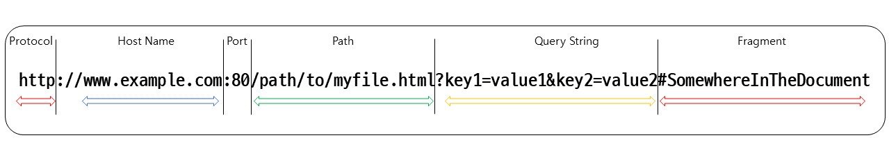

# 웹 프로그래밍의 이해

* 웹 프로그램은 기본적으로 클라이언트-서버로 이루어진다.
* 이외에도 이 둘 간의 통신 규약인 HTTP 프로토콜, URL, 웹서버와 웹 애플리케이션 서버 간의 차이점들에 대해 알아보자.


## 1. Web Programming

* HTTP(s) 프로토콜로 통신하는 클라이언트와 서버를 개발하는 것.
  * 웹 클라이언트, 웹 서버 같이 개발도 가능하고, 둘중 하나만 개발할 수도 있음.
* 일반적으로 웹 서버를 개발하는 경우가 많음.
* 파이썬 웹 프로그래밍이라고 하면, django와 같은 웹 프레임워크를 사용하여 웹 서버를 개발하는 것
* 쉽게 말해 웹 브라우저를 실행하여 네이버에 접속하는 것도 웹 프로그램이 동작하는 것
  * 웹 브라우저(웹 클라이언트), 네이버 서버(웹 서버)
  * 웹 클라이언트가 요청하고 웹 서버가 응답하는 클라이언트-서버 프로그램이 동작하는 것이다.


<center><small>생활코딩 : <a href='https://opentutorials.org/course/2614/14790'>https://opentutorials.org/course/2614/14790</a></small></center>


## 2. HTTP 프로토콜

* HTTP(Hypertext Transfer Protocol)

  * 웹 서버와 웹 클라이언트 사이에서 데이터를 주고받기 위한 통신 방식
  * TCP/IP 프로토콜 위에서 동작함 -> 웹 이용을 위해서 웹서버와 웹 클라이언트는 TCP/IP 동작에 필수적인 IP 주소를 가져야함.
  * HTML 이나 XML과 같은 하이퍼텍스트뿐만 아니라, 이미지, 음성, 동영상, 자바스크립트, PDF와 각종 오피스 document 파일 등 컴퓨터에서 다룰 수 있는 데이터라면 무엇이든 전송 가능

  

* 예시 - 웹 브라우저의 주소 창에 www.naver.com을 입력하고 엔터를 누르면, 

  1. 웹 클라이언트와 웹 서버 사이에 HTTP 연결이 맺어짐.
  2. 웹 클라이언트는 웹 서버에 HTTP 요청 메시지를 보냄
  3. 웹 서버는 요청에 따른 처리를 진행하고 그 결과를 웹 클라이언트에게 HTTP 응답 메시지를 보냄

  * 위의 방식으로 요청 메시지와 응답 메시지가 반복적으로 오가면서 웹을 사용한다.


### 1) HTTP 메시지 구조

* HTTP 메시지는 클라이언트에서 서버로 보내는 요청 메시지와 클라이언트로 보내는 응답 메시지 2가지가 있다.


<center><small>출처 : <a href='https://deepwelloper.tistory.com/98'>https://deepwelloper.tistory.com/98</a></small></center>

* 헤더는 각 행의 끝에 줄 바꿈 문자인 CRLF(Carriage Return Line Feed)가 있고, 헤더와 바디는 빈 줄로 구분함.
* 헤더와 바디는 생략 가능
* 바디에는 텍스트 뿐만 아니라 바이너리 데이터도 들어갈 수 있음.


### 2) HTTP 처리 방식

* HTTP method를 통해서 클라이언트가 원하는 처리 방식을 서버에 알려줌

| 메소드명 | 의미                             |
| :------- | -------------------------------- |
| GET      | 리소스 취득                      |
| POST     | 리소스 생성, 리소스 데이터 추가  |
| PUT      | 리소스 변경                      |
| DELETE   | 리소스 삭제                      |
| HEAD     | 리소스 헤더(메타데이터) 취득     |
| OPTIONS  | 리소스가 서포트하는 메소드 취득  |
| TRACE    | 루프백 시험에 사용               |
| CONNECT  | 프록시 동작의 터널 접속으로 변경 |

* 주로 사용되는 메소드
* GET 
  * 지정한 URL의 정보를 가져오는 메소드로 웹 브라우저를 이용해 서버로부터 웹 페이지, 이미지, 동영상 등을 가져오려고 할 때 수많은 GET 방식 요청 사용
  * URL 부분의 ? 뒤에 `이름=값` 쌍으로 이어붙여 보냄

* POST
  * 리소스 생성 기능(EX. 블로그에 글 등록)
  * GET 방식과 달리 파라미터들을 요청 메시지의 바디에 넣어 보냄.
  * URL은 길이 제한이 있고, 보안 측면(웹 브라우저의 주소창에 사용자의 데이터가 노출)

* PUT

  리소스를 변경하는데 사용(EX. 등록한 블로그 글의 작성자 및 글 내용 업데이트)

* DELETE

  리소스를 삭제하는 메소드


### 3) 상태코드

* 서버에서의 처리 결과는 응답 메시지의 상태라인에 있는 상태 코드(status code)를 보고 파악이 가능

* 상태 코드는 세자리 숫자로 되어 있음.

  * 첫번째 숫자 : HTTP 응답의 종류를 구분
  * 두번째, 세번째 숫자 : 세부적인 응답 내용 구분을 위한 번호

  

* 상태코드 분류

| 메소드명 | 의미                              | CRUD와 매핑되는 역할                                         |
| -------- | --------------------------------- | ------------------------------------------------------------ |
| 1xx      | Informational<br>(정보 제공)      | 임시적인 응답으로, 현재 클라이언트의 요청까지 처리되었으니 계속 진행하라는 의미 |
| 2xx      | Success<br>(성공)                 | 클라이언트 요청이 서버에서 성공적으로 처리되었음             |
| 3xx      | Redirection<br>(리다이렉션)       | 완전한 처리를 위해 추가적인 동작이 필요.<br>주로 서버의 주소 또는 요청한 URI의 웹 문서가 이동된 경우 그 주소로 다시 시도해보라는 의미 |
| 4xx      | Client Error<br>(클라이언트 에러) | 클라이언트 요청 메시지 내용이 잘못된 경우<br>(Ex.없는 페이지 요청시) |
| 5xx      | Server Error<br>서버에러          | 서버 측 사정에 의해 메시지 처리에 문제가 생긴 경우<br>서버 부하, DB 처리과정 오류, 서버 Exception 등 |

* [자주 사용되는 상태 코드](https://developer.mozilla.org/ko/docs/Web/HTTP/Status)
* [위키](https://ko.wikipedia.org/wiki/HTTP_%EC%83%81%ED%83%9C_%EC%BD%94%EB%93%9C)에도 정리되어 있으므로 참고


## 3. URL 설계

* 웹 애플리케이션 개발 시 고객 요구사항이 정리되고, 두 가지 측면으로 진행된다.
  * 디자인 측면 :  화면 UI를 설계
  * 프로그램 로직 측면 : URL을 설계
* URL 설계는 웹 서버 로직 설계의 첫걸음이고, 사용자 또는 웹 클라이언트에게 웹 서버가 가지고 있는 기능을 명시해주는 중요한 단계
* 전체 프로그램 로직을 생각해, 차후 로직이 변경되더라도 URL 변경은 최소화할 수 있도록 **유연하게 설계**하는 것이 중요

* 예시 URL



* Domain : 웹 서버의 호스트 명으로, 도메인명 또는 IP 주소로 표현됨
* Port : 웹 서버 내의 서비스 포트번호 (생략 시 default로 http는 80, https는 443 사용)
  * 웹 서버에서 자원을 접근하기 위해 사용하는 관문(gate)을 가리킴
* Path : 웹서버에서 자원에 대한 경로 (물리적 경로가 아니라 웹 서버에서 추상화하여 보여줌)
* Query String : 질의 문자열로 '&'로 구분된 `이름=값` 형식으로 짝을 이룬 리스트
  * 자원 반환 전에 추가적인 작업을 위해 이런 파라미터들을 사용 가능
* Fragment : 자원 자체의 다른 부분에 대한 anchor(닻)을 의미
  * anchor는 일종의 "bookmark" ("bookmarked" 지점에 위치된 내용을 보여주기 위해 브라우저에게 방향을 알려줌.)


### 1) URL을 바라보는 측면

* URL은 웹 클라이언트에서 호출한다는 시점에서 보면, 웹 서버에서 존재하는 애플리케이션에 대한 API(Application Programming Interface)라 할 수 있다.

* API 명명 규칙을 정하는 방법

  1. RPC(Remote Procedure Call)

     * 클라이언트가 네트워크상에서 원격에 있는 서버가 제공하는 API 함수를 호출하는 방식
     * 웹 개발 초기부터 사용된 방식으로, REST 방식이 나오며 사용빈도가 줄어들었지만 여전히 사용 중
     * 예시

     ```
     http://blog.example.com/search?q=test&debug=true
     ```

  2. REST(Representational State Transfer)

     * 웹 서버에서 존재하는 요소들을 모두 리소스라고 정의하고, URL을 통해 웹 서버의 특정 리소스를 표현
     * 리소스는 시간에 따라 상태가 변할 수 있으므로, 클라이언트와 서버 간에 데이터 교환을 리소스 상태의 교환으로 간주함
     * 리소스에 대한 조작을 GET, POST, PUT, DELETE 등의 HTTP 메소드로 구분
     * 예시

     ```
     http://blog.example.com/search/test
     ```


### 2) 파이썬의 URL

* 파이썬 프레임워크에서는 처음부터 간편 URL 채택
* 외에도 URL을 정의하기 위해 정규표현식을 추가적으로 사용 가능

* 예시

  ```python
  urlpatterns = [
      path('cafelist/', cafelist),
      path('cafelist/<int:pk>', cafedetails),
  ]
  ```

  

## 4. 웹 애플리케이션 서버

* 웹 클라이언트의 요청을 받아 처리하는 서버를 통칭하여 웹 서버라 부름.
* 하지만, 좀 더 세분화하면, 웹 서버와 웹 애플리케이션 서버로 분류 가능

| 구분                 | 역할                                                         |
| -------------------- | ------------------------------------------------------------ |
| 웹 서버              | 웹 클라이언트의 요청을 받아 요청 처리 및 응답<br>정적 페이지인 HTML, 이미지, CSS, javascript 파일을 웹 클라이언트에게 제공 시 사용<br>만약 동적 페이지 처리 필요시 웹 애플리케이션 서버에 넘김 |
| 웹 애플리케이션 서버 | 웹 서버로부터 동적 페이지를 요청 받아 요청을 처리, 그 결과를 웹 서버로 반환<br>주로 동적 페이지 생성을 위한 프로그램 실행 및 데이터베이스 연동 기능 처리 |


### 1) 정적 페이지 vs 동적 페이지

* 정적(static) 페이지 

  * 누가, 언제 요구하더라도 항상 같은 내용을 표시하는 웹 페이지
  * 해당 웹 서비스 제공자가 사전에 준비해 서버 측에 배치한 것.
  * 동일한 리소스 요청에 대해서 항상 동일한 내용의 페이지를 반환함
  * 주로 HTML, 자바스크립트, CSS, 이미지만으로 이루어진 페이지가 해당됨

* 동적(dynamic) 페이지 

  * 동일한 리소스의 요청이라도 누가, 언제, 어떻게 요구했는지에 따라 각각 다른 내용이 반환되는 페이지
  * Ex. 현재 시각을 보여주는 페이지, 사용자에 따라 다른 화면을 보여주는 쇼핑 사이트

* 정적 / 동적이란 용어는 사용자가 페이지를 요청하는 시점에 페이지의 내용이 유지, 또는 변경을 구분해주는 용어

  * 동적 페이지에는 프로그래밍 코드가 포함되어 있어 페이지 요청 시점에 HTML 문장을 만들어 냄.

  

* CGI(Common Gateway Interface)
  * 동적 페이지 및 데이터베이스 처리 요구사항 증대로 웹 서버와는 다른 별도 프로그램의 필요성으로 인해 별도 프로그램과 웹 서버 사이에 정보를 주고받는 규칙을 정의하는 CGI 규격이 탄생

  

### 2) 애플리케이션 서버 방식

* CGI 방식의 근본적인 문제점인 **각각의 클라이언트 요청에 대해 독립적인 별도의 프로세스가 생성된다는 점**은 요청 증가에 따라 <u>프로세스와 메모리 요구량의 증대를 야기</u>해 시스템 부하를 주므로 이를 해결하기 위해 여러 기술이 등장하였는데, 그 중 하나가 **애플리케이션 서버 방식**이다.
* 애플리케이션 서버 방식
  * 웹 서버가 직접 프로그램을 호출하기 보다, 웹 애플리케이션 서버를 통해 간접적으로 웹 애플리케이션 프로그램을 실행함.
  * 웹 애플리케이션 서버는 애플리케이션 프로그램의 실행 결과를 웹 서버에 전달, 웹 서버는 웹 애플리케이션 서버로부터 전달받은 응답 결과를 웹 클라이언트에게 전송


[](https://rrhh234cm.tistory.com/456)

<center><small>애플리케이션 서버 방식에서의 서버 간 구성도</small></center>

* 웹 서버와 웹 애플리케이션 서버가 분리됨에 따라 서로의 역할도 구분하여 사용(동적이 정적보다 메모리 소비가 더 크기 때문)
  * **웹 서버**는 정적 페이지만 처리, 웹 애플리케이션 서버는 동적 페이지만 처리하도록 역할 분담
  * **웹 서버**는 이 외에도 캐시 기능, 프록시 기능 등의 추가적인 기능을 제공하도록 발전
  * 더해서, 동시 접속 허가 클라이언트 수의 제한 및 처리 프로세스 관리, 요청 및 응답에 관한 로그 기록등과 같은 기능들도 제공하며 전문화되는 방향으로 발전 중
  * **웹 애플리케이션 서버**는 웹 서버와의 연동 규격을 잘 따르기만 하면, 임의의 언어 플랫폼을 사용해서 애플리케이션 프로그램을 작성하고 실행시킬 수 있어 기능 추가 및 종류가 다양해지고 있다.
    * 자바 계열 : Tomcat / 루비 계열 : Unicorn / 파이썬 계열 : uWSGI 등
    * 성능과 안정성 측면이 불안해 개발용으로 제한적 사용 중

