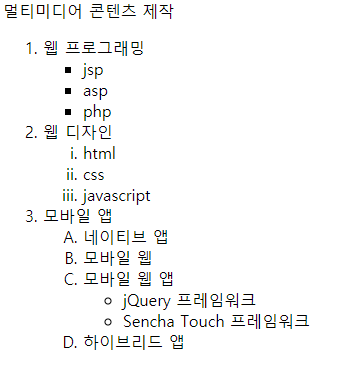

# 텍스트 관련 태그

## 1. Block Level element

> 줄바꿈이 일어나는 블록 요소

* `<hn> </hn>`

  * Headline의 약어로, 제목을 위해 사용한다.
  * 줄바꿈하여 표시된다.
  * 제목 표시(h1 > h2 > .... > h6) Ex.(`<h1> </h1>`)
  * 이 태그는 단순히 글자 크기를 줄이는 용도로는 사용해서는 안된다.
    * 만약 크기 조정이 필요한 경우, `font-size` 속성을 통해 수정

* `<p> </p>` 

  * 문단을 나누는 태그(paragraph)
  * `<br>` 태그를 2번 사용한 만큼의 간격을 보인다.
  * `<p>` 태그를 여러 번 연속적으로 사용해도 행 간격이 더 벌어지지 않는다.

* `<br>`

  * 줄 바꿈 태그
  * 여러 줄을 바꾸려면 여러 개 사용이 가능하다. (`<br><br><br>`)

* `<hr>`

  * 수평선(A horizontal rule) 긋기
  * 종료 태그 없이 `<hr>` 태그를 쓰면 됨.
  * 주제가 다른 컨텐츠를 구분하는 역할을 한다.

* `<blockquote> </blockquote>` 

  * 인용문 넣기
  * 줄바꿈되고 안으로 들여쓰기로 표시가 된다.

  ```html
  <blockquote cite="https://www.goodreads.com/quotes/228382-while-one-person-hesitates-because-he-feels-inferior-the-other">
      한 사람이 열등감으로 주저하는 동안, 다른 이는 실수를 저지르며 점점 우등한 사람이 되어간다.
  </blockquote>
  ```

  * `cite` 속성은 인용문의 출처를 남길 수 있다.
    * 화면에서 특별히 표시되지는 않지만, 검색 엔진이 이 주소 정보를 사용할 수 있다.

* `<pre> </pre>`

  * 입력한 형식 그대로 출력된다.
  * 텍스트의 공백과 줄바꿈을 유지하면서 표시 가능


## 2. Inline level element

> 줄바꿈이 일어나지 않는 인라인 요소

* `<strong> </strong>`
  
  * 텍스트 강조
* `<b></b>`
  
  * 텍스트 강조
* strong 태그는 **의미 전달**도 같이 된다. 굵은 표시로 **시각적 효과**도 보여주지만, **중요한 의미라는 것도 전달**한다. (중요도를 높이고 싶다면 여러 번 겹쳐 쓸 수도 있다.)반면에 b 태그는 **특별한 의미를 가지지 않고**, 단순히 시각적인 효과만 전달해 읽기 흐름에 도움을 주는 용도로 사용된다.
* `<i></i>` `<em> </em>`
  * 둘 다 이탤릭체를 표시되지만 em 태그의 경우 텍스트를 강조하는 의미를 포함한다.
  * 따라서 `em`의 경우 중첩해서 사용할 경우 강조 의미가 강해진다.

* `<sub>` `<sup>`

* `sub`은 아래첨자, `sup`은 윗첨자를 표시한다.

  ```html
  텍스트<sub> sub : 아래첨자</sub><br>
  텍스트<sup> sup : 위첨자</sup><br>
  ```

* `small`
  
* 현재 설정된 크기보다 2포인트 작게 표시한다.
  
* `<ins> </ins>` :  밑줄 표시
* `<del> </del>` : 취소선 표시

* `<span></span>`
  * 줄바꿈 없이 영역을 묶는 태그
  * 태그 자체로는 아무 의미가 없지만, 텍스트 단락 안에서 줄바꿈 없이 일부 텍스트만 묶어서, **스타일을 적용하려고 할 때 주로 사용**한다.
* `<q> </q>`
  * 간단한 인용문 표시
  * 줄바꿈 없이 다른 내용과 한 줄에 표시된다. 
  * 자동으로 따옴표(" ") 삽입이 일어난다.


### - Anchor 태그

* 하이퍼링크로 문서를 연결하는 `<a>` 태그 (앵커 태그)
  * 원하는 문서나 사이트로 연결할 수 있다.
  * 새 창 또는 새 탭에서 링크 열기를 할 수 있다.
  * 한 페이지 안에서 지정된 영역으로 이동할 수 있다.

* 속성
  * `href`
    * Hypertext Reference
    * 이동하고자 하는 곳의 위치(파일 경로)
  * `name`
    * 하이퍼링크의 이름을 지정한다.
  * `target`
    * 연결된 문서가 보여줄 위치(프레임으로 나누었을 경우 해당 프레임 이름을 작성)
      * 속성
        * `_self` : default, 링크가 있는 화면에서 열린다.
        * `_blank` : 새 탭, 새 창에서 열림.
        * `_parant` : 현재 프레임을 호출한 상위 프레임에 출력한다.
        * `_top` : 프레임을 모두 없애고 화면 전체에 출력한다.
  * `download`
    * 링크한 내용을 보여주지 않고 다운로드함.

#### 1) 사이트로 이동하기

``` html
<h3>사이트로 이동</h3>
<a href="http://www.naver.com">네이버 사이트로 이동</a>
```

#### 2) 같은 페이지 내에서 이동하기

* 기본 형식

  ```html
  <태그 id = "앵커 이름">텍스트 또는 이미지</태그>
  <a href="#앵커 이름">텍스트 또는 이미지</a>
  ```

* 적용 예제

  ```html
  <h3>문서 내 다른 영역으로 이동</h3>
  <a href="#javascript">id가 javascript인 영역으로 이동</a>
  <a href="#jquery">id가 jquery인 영역으로 이동</a>
  <a href="#css">id가 css인 영역으로 이동</a>
  <h3 id="javascript">자바스크립트</h3>
  <p>
      Lorem ipsum dolor sit amet, consectetur adipiscing elit, sed do eiusmod tempor incididunt ut labore et dolore magna aliqua.
  </p>
  <h3 id="jquery">jquery</h3>
  <p>
      Ut enim ad minim veniam, quis nostrud exercitation ullamco laboris nisi ut aliquip ex ea commodo consequat. Duis aute irure dolor in reprehenderit in voluptate velit esse cillum dolore eu fugiat nulla pariatur.
  </p>
  <h3 id="css">css</h3>
  <p>
      Excepteur sint occaecat cupidatat non proident, sunt in culpa qui officia deserunt mollit anim id est laborum.
  </p>
  ```

  

### - 목록 태그

* 기본 목록 태그

* `<ul></ul>`

  * 순서가 없는 목록 (**U**nordered **L**ist )
  * 속성
    * `type`
      * shape를 지정
      * `disc`  : 검은 원(default)
      * `circle` : 흰 원
      * `square` : 사각형

* `<ol></ol>`

  * 순서가 있는 목록 (**O**rdered **L**ist)
  * 속성
    * `type`
      * shape를 지정
      * `1` : 숫자 (default)
      * `a` :  영어 소문자
      * `A` : 영어 대문자
      * `i` : 소문자 로마 숫자
      * `I` : 대문자 로마 숫자
    * `start`
      * `n` : 시작 숫자를 지정
    * `reversed`
      * 역순으로 표시된다(IE11 지원이 안됨)

* `<li></li>`

  * 목록 내 각 항목 (**L**ist **I**tem)


#### 1) 기본 리스트

```html
<!-- 순서가 없는 목록 -->
<h3> 순서가 없는 목록</h3>
<ul type="disc">
    <li>Javascript/jquery</li>
    <li>웹 프로그래밍</li>
    <li>인터넷 프로그래밍</li>
    <li>데이터베이스</li>
</ul>
<!-- 순서가 있는 목록 -->
<h3>순서가 있는 목록</h3>
<ol type="1">
    <li>Javascript/jquery</li>
    <li>웹 프로그래밍</li>
    <li>인터넷 프로그래밍</li>
    <li>데이터베이스</li>
</ol>
```

#### 2) 중첩 리스트

* 목록은 중첩해서 사용할 수 있다.

```html
<ol type="1">
    <li>웹 프로그래밍</li>
        <ul type="square">
            <li> jsp </li>
            <li> asp </li>
            <li> php </li>
        </ul>
    <li> 웹 디자인</li>
        <ol type="i" start="1">
            <li> html </li>
            <li> css </li>
            <li> javascript</li>
        </ol>
    <li> 모바일 앱</li>
        <ol type="A">
            <li>네이티브 앱</li>
            <li>모바일 웹</li>
            <li>모바일 웹 앱</li>
            <ul type="circle">
                <li> jQuery 프레임워크</li>
                <li> Sencha Touch 프레임워크</li>
            </ul>
            <li>하이브리드 앱</li>
        </ol>
</ol>
```

---

* 출력 결과는 아래와 같다.



* `<dl>`, `<dt>`, `<dd>` 

  * 제목과 설명이 한 쌍인 목록 만들기
  * 기본 형식

  ```html
  <!-- dt(용어)와 dd(정의) dl(쌍들의 영역)-->
  <dl>
  	<dt>제목</dt>
  	<dd>내용</dd>
  	<dd>내용</dd>
  </dl>
  ```

  * `<dl>` 태그는 `<dt>`, `<dd>`만 포함하고 있을 수 있다.

    * 따라서 `<div>`와 같은 다른 태그가 올 수 없어 제한적인 부분이 많다.

      -> `<ul> ` / `<ol>` 태그로 대체하여 사용하는 경우가 많음.

  * Key - value 형태를 표시할 때 유용하다.

### - 테이블 태그

* `<table> </table>`

  * 테이블 선언 태그

  * 속성

    | 속성               | 설명                                   |
    | ------------------ | -------------------------------------- |
    | `align`            | 테이블 정렬방식(left / right / center) |
    | `border`           | 테이블 테두리, 생략하면 테두리 없음    |
    | `bordercolor`      | 테두리 색상                            |
    | `width`            | 테이블의 너비 (가로 길이)              |
    | `height`           | 테이블의 높이(세로 길이)               |
    | `bgcolor`          | 테이블 배경색                          |
    | `background`       | 테이블에 배경 이미지 넣기              |
    | `cellspacing`      | 셀과 셀 사이의 여백                    |
    | `cellpadding`      | 텍스트와 셀 사이의 여백                |
    | `valign`           | 셀의 수직 정렬 (top / middle / bottom) |
    | `align`            | 셀의 수평 정렬 (left / right / center) |
    | `width`            | 셀의 가로 길이                         |
    | `height`           | 셀의 세로 길이                         |
    | `rowspan`          | 행 합치기                              |
    | `colspan`          | 열 합치기                              |
    | `aria-describedby` | 표에 대한 설명 제공                    |

* `<tr> </tr>` 

  * 테이블 내에 한 행을 정의하는 태그

* `<td> </td>`

  * 테이블 내의 한 열, 즉 셀을 만들 때 사용되는 크기

* `<th> </th>`

  * 헤더(머리글 칸)

* `<caption>`
  * 테이블에 제목을 설정한다.
  * `<table>` 태그 바로 다음에 작성해야 하고 태그 당 하나의 `<caption>`만 사용 가능하다.

* `<col>` / `<colgroup>`
  * 여러 열을 묶기
  * 몇 개씩 열을 묶어 한꺼번에 스타일을 지정할 때 사용한다.
  * `<caption>` 태그 뒤 `<tr>`, `<td>` 태그 이전에 사용해야 한다.
* `<thead>` / `<tbody>` / `<tfoot>`
  * 표의 머리글(`<thead>`), 본문(`<tbody>`)과 바닥글(`<tfoot>`) 등을 구분한다.
  * 셀을 그룹지어 놓으면, 시각 장애인들도 화면 판독기를 통해 테이블의 구조를 쉽게 이해할 수 있고, CSS를 사용하여 테이블의 각 부분에 다른 스타일을 적용할 수 있다.